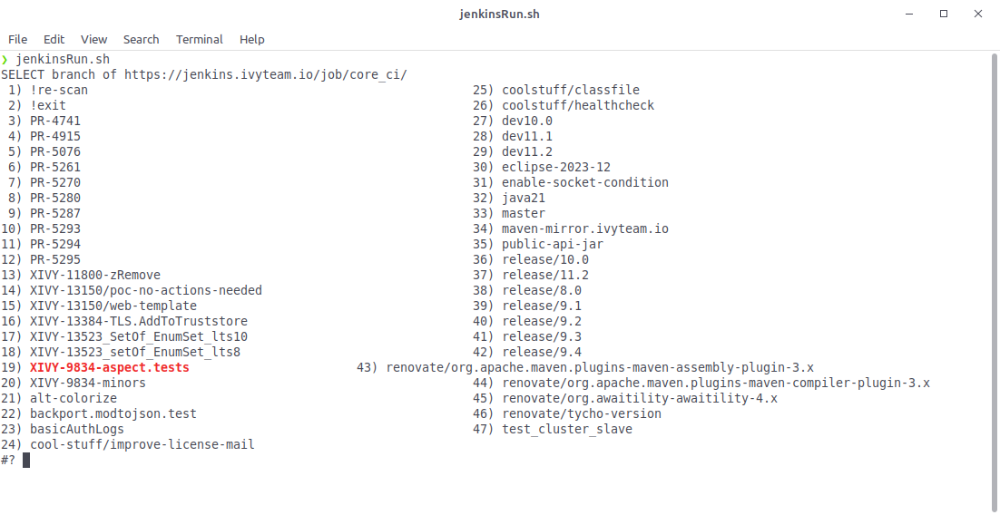
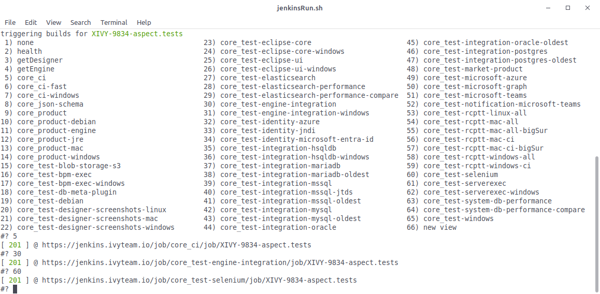
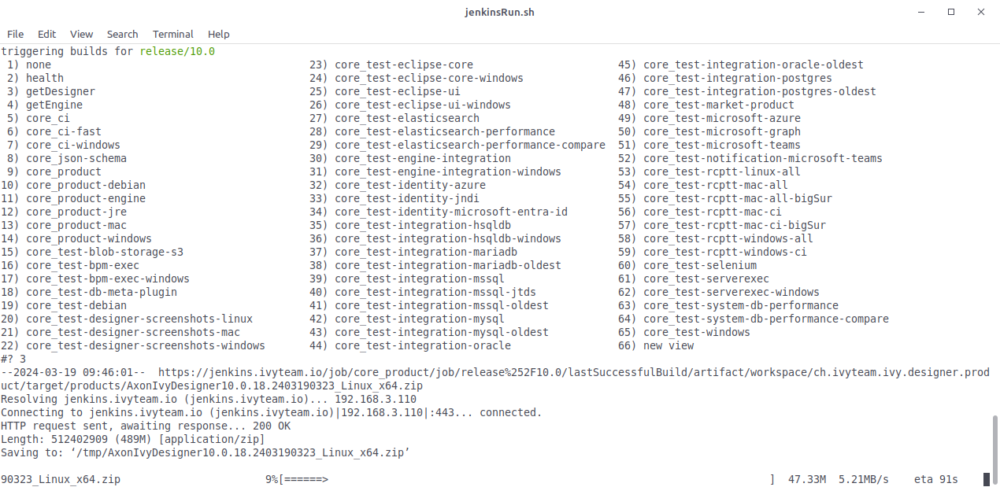

# Jenkins CLI

Jenkins CLI tooling for the ivy-core developer team.
Giving you speed in daily repetitive work.

This is a [debianDevSystem](https://github.com/ivy-rew/debianDevSystem) sub-project of old, now living in it's own dedicated repo.

## Features

Branch focused CLI actions:

Trigger builds fast with zero clicking:

Download products and unpack

